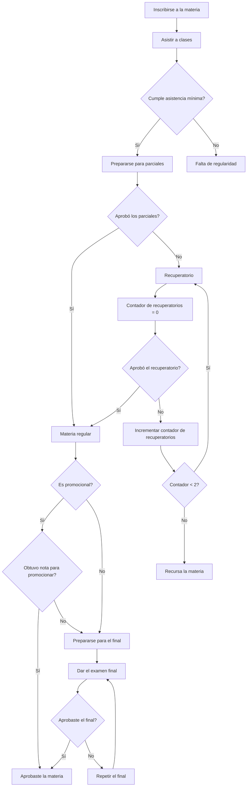

# MermaidTest

```mermaid
graph TD
    A[Inscribirse a la materia] --> B[Asistir a clases]
    B --> C{Cumple asistencia mínima?}
    C -->|Sí| D[Prepararse para parciales]
    C -->|No| X[Falta de regularidad]
    D --> E{Aprobó los parciales?}
    E -->|Sí| G[Materia regular]
    E -->|No| F[Recuperatorios]
    F --> R[Contador de recuperatorios = 0]
    R --> F1{Aprobó el recuperatorio?}
    F1 -->|Sí| G
    F1 -->|No| R2[Incrementar contador de recuperatorios]
    R2 --> F2{Contador < 2?}
    F2 -->|Sí| F[Recuperatorio]
    F2 -->|No| Z[Recursa la materia]
    G --> H{Es promocional?}
    H -->|Sí| I{Obtuvo nota para promocionar?}
    I -->|Sí| Y[Aprobaste la materia]
    I -->|No| J[Prepararse para el final]
    H -->|No| J[Prepararse para el final]
    J --> K[Dar el examen final]
    K --> L{Aprobaste el final?}
    L -->|Sí| Y[Aprobaste la materia]
    L -->|No| M[Repetir el final]
    M --> K
```
